```{r, echo = FALSE}
# https://stackoverflow.com/questions/25646333/code-chunk-font-size-in-rmarkdown-with-knitr-and-latex
def.chunk.hook  <- knitr::knit_hooks$get("chunk")
knitr::knit_hooks$set(chunk = function(x, options) {
  x <- def.chunk.hook(x, options)
  ifelse(options$size != "normalsize", paste0("\\", options$size,"\n\n", x, "\n\n \\normalsize"), x)
})
knitr::opts_chunk$set(echo = TRUE, cache = TRUE)
```

## TOC

\textblockcolour{mDarkTeal}

\huge

- Introduction to the data

- Cultural Distance

- Cultural and Spatial Distance

- Simulation


# Introduction

## Data

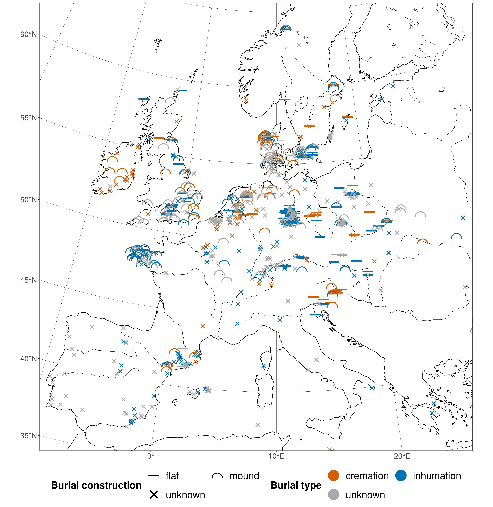{ height=85% }

\begin{textblock*}{65pt}(5pt,40pt)
  \textblockcolour{niceorange}
  \setlength\fboxrule{2pt}%
  \noindent\fbox{%
    \begin{minipage}{\linewidth - 2\fboxsep - 2\fboxrule}%
      \raggedright\footnotesize\color{white}
      \textbf{Radon-B:} Database of \textsuperscript{14}C dates for the european Bronze Age
    \end{minipage}}%
\end{textblock*}

\begin{textblock*}{65pt}(5pt,100pt)
  \setlength\fboxrule{2pt}%
  \noindent\fbox{%
    \begin{minipage}{\linewidth - 2\fboxsep - 2\fboxrule}%
      \raggedright\footnotesize\color{white}
      \textsuperscript{14}C dating is an important absolute dating method: One date equals a \textbf{fuzzy point in space and time with context information}
    \end{minipage}}%
\end{textblock*}

\begin{textblock*}{65pt}(295pt,40pt)
  \setlength\fboxrule{2pt}%
  \noindent\fbox{%
    \begin{minipage}{\linewidth - 2\fboxsep - 2\fboxrule}%
      \raggedright\footnotesize\color{white}
      Context for dates from graves: \textbf{burial type} \& \textbf{burial construction}
    \end{minipage}}%
\end{textblock*}

\begin{textblock*}{65pt}(295pt,100pt)
  \setlength\fboxrule{2pt}%
  \noindent\fbox{%
    \begin{minipage}{\linewidth - 2\fboxsep - 2\fboxrule}%
      \raggedright\footnotesize\color{white}
      Heterogeneous \textbf{information density} in space and time
    \end{minipage}}%
\end{textblock*}

## Research Area and Regions

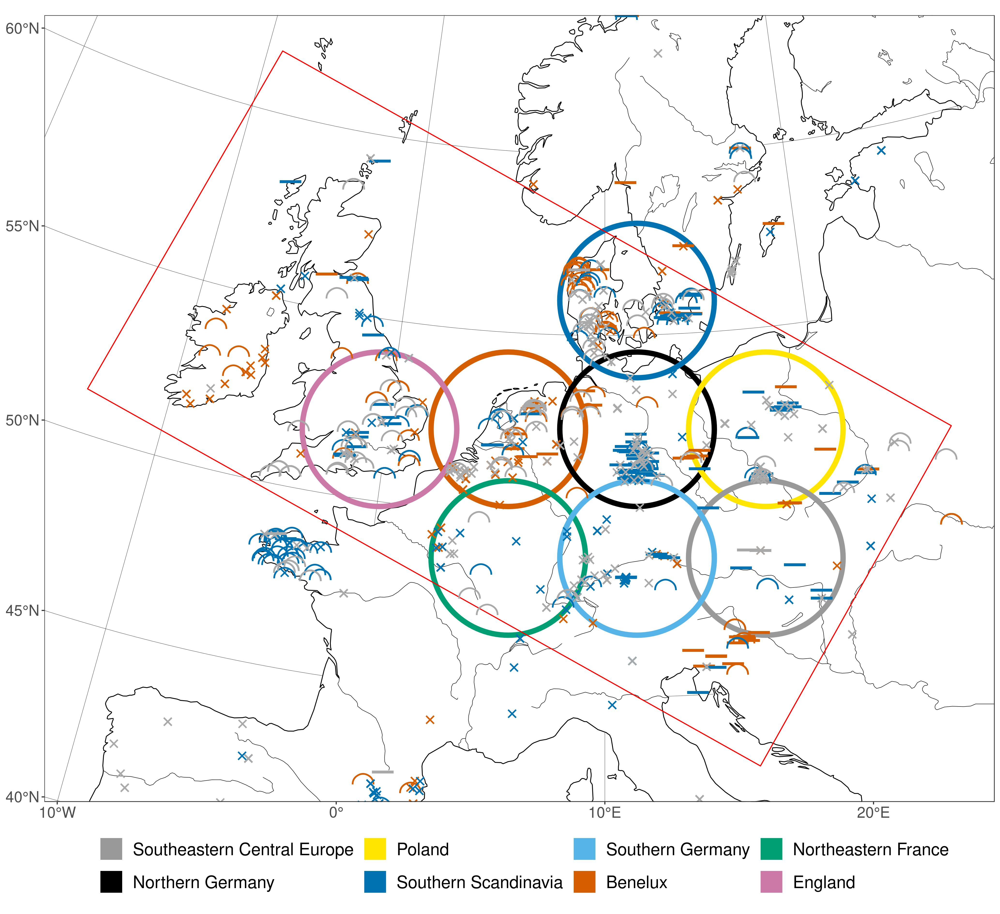{ height=85% }

\begin{textblock*}{75pt}(30pt,140pt)
  \setlength\fboxrule{2pt}%
  \noindent\fbox{%
    \begin{minipage}{\linewidth - 2\fboxsep - 2\fboxrule}%
      \raggedright\footnotesize\color{white}
      Divide and Conquer: Separation into eight \textbf{artificial regions} within the area of the highest data density
    \end{minipage}}%
\end{textblock*}

## Development -- Absolute Numbers

\begin{columns}
  \begin{column}{0.48\textwidth}  
    \begin{figure}
      \includegraphics{figures/development_amount_regions_burial_type.jpeg}
      \caption{\textbf{burial type} development: Sum of \textsuperscript{14}C dates whose $2\sigma$ range cover the respective year.}
    \end{figure}
  \end{column}
  \begin{column}{0.35\textwidth}
    \begin{figure}
      \includegraphics{figures/development_amount_regions_burial_construction.jpeg}
      \caption{\textbf{burial construction}}
      \vspace{1.8cm}
    \end{figure}
  \end{column}
\end{columns}

\begin{textblock*}{120pt}(215pt,220pt)
  \setlength\fboxrule{2pt}%
  \noindent\fbox{%
    \begin{minipage}{\linewidth - 2\fboxsep - 2\fboxrule}%
      \raggedright\footnotesize\color{white}
      Data structure transformation: Individual \textsuperscript{14}C dates to region wise \textbf{time series} of burial rite \textbf{presence}
    \end{minipage}}%
\end{textblock*}

## Development -- Proportions

\begin{columns}
  \begin{column}{0.48\textwidth}
    \begin{figure}
      \includegraphics{figures/development_proportions_regions_burial_type.jpeg}
      \caption{\textbf{burial type} development: Year wise proportions of dates. \textit{unknown} is filtered out.}
    \end{figure}
  \end{column}
  \begin{column}{0.35\textwidth}
    \begin{figure}
      \includegraphics{figures/development_proportions_regions_burial_construction.jpeg}
      \caption{\textbf{burial construction}}
      \vspace{1.8cm}
    \end{figure}
  \end{column}
\end{columns}

\begin{textblock*}{120pt}(215pt,220pt)
  \setlength\fboxrule{2pt}%
  \noindent\fbox{%
    \begin{minipage}{\linewidth - 2\fboxsep - 2\fboxrule}%
      \raggedright\footnotesize\color{white}
      Data structure transformation: Time series of absolute appearances to \textbf{time series} of burial rite \textbf{proportions} -- \textbf{burial rite proxy}
    \end{minipage}}%
\end{textblock*}

# Cultural Distance

## Squared Euclidian Distance (SED)

**Question:** How do the developments in these regions for **burial type** and **burial construction** relate to each other? Which regions behave alike?

\usebeamertemplate*{title separator}

The **Squared Euclidian Distance** is a a simple **measure of between-group similarity** that can be applied to the **burial rite proxy** data.

\huge $$d_{ij}^2 = \sum_{k = 1}^{n} (p_{ik} - p_{jk})^2$$ \normalsize

- $d_{ij}^2$: Squared Euclidean Distance between two groups $i$ and $j$
- $k$: Variant counter
- $n$: Total amount of variants in a population
- $p_{ik}$: Relative frequency of the $k$'th variant in population $i$
- $p_{jk}$: Relative frequency of the $k$'th variant in population $j$

## Region-Region Distance Matrix

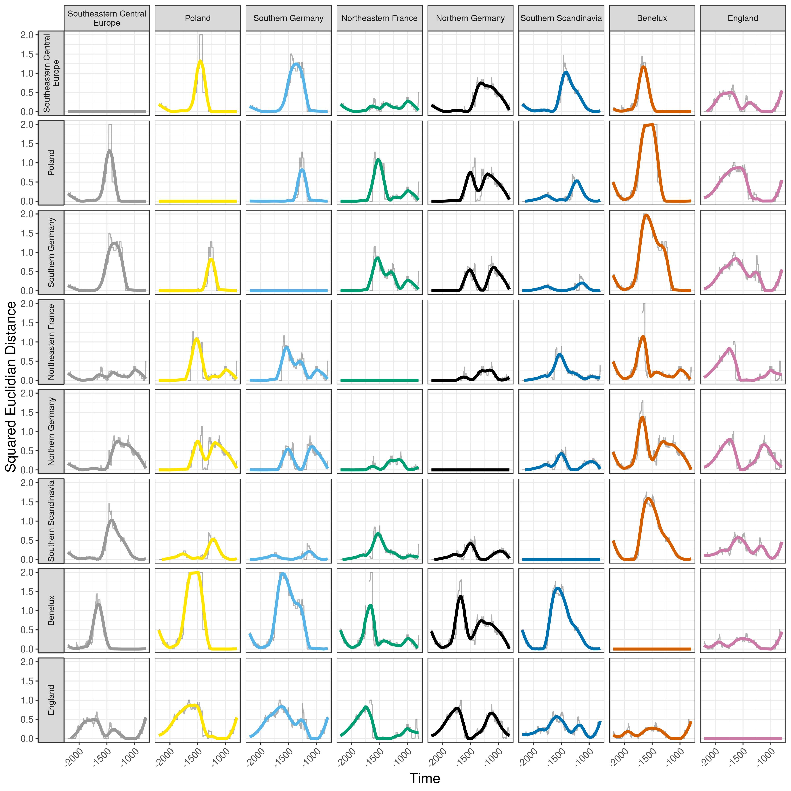{ height=85% }

\begin{textblock*}{65pt}(5pt,40pt)
  \textblockcolour{niceorange}
  \setlength\fboxrule{2pt}%
  \noindent\fbox{%
    \begin{minipage}{\linewidth - 2\fboxsep - 2\fboxrule}%
      \raggedright\footnotesize\color{white}
      The \textbf{SED} can be calculated for every year of every one of the $8*8=64$ region relationships
    \end{minipage}}%
\end{textblock*}

\begin{textblock*}{65pt}(295pt,40pt)
  \setlength\fboxrule{2pt}%
  \noindent\fbox{%
    \begin{minipage}{\linewidth - 2\fboxsep - 2\fboxrule}%
      \raggedright\footnotesize\color{white}
      Low distance at the start and end due to the \textbf{universal shift from inhumation to cremation} with rise of the \textbf{Urnfield culture}
    \end{minipage}}%
\end{textblock*}

\begin{textblock*}{65pt}(295pt,125pt)
  \setlength\fboxrule{2pt}%
  \noindent\fbox{%
    \begin{minipage}{\linewidth - 2\fboxsep - 2\fboxrule}%
      \raggedright\footnotesize\color{white}
      The different \textbf{adoption rates} are visible as \textbf{peaks of cultural distance}
    \end{minipage}}%
\end{textblock*}

<!--

## Mean Region-Region Distance Matrix

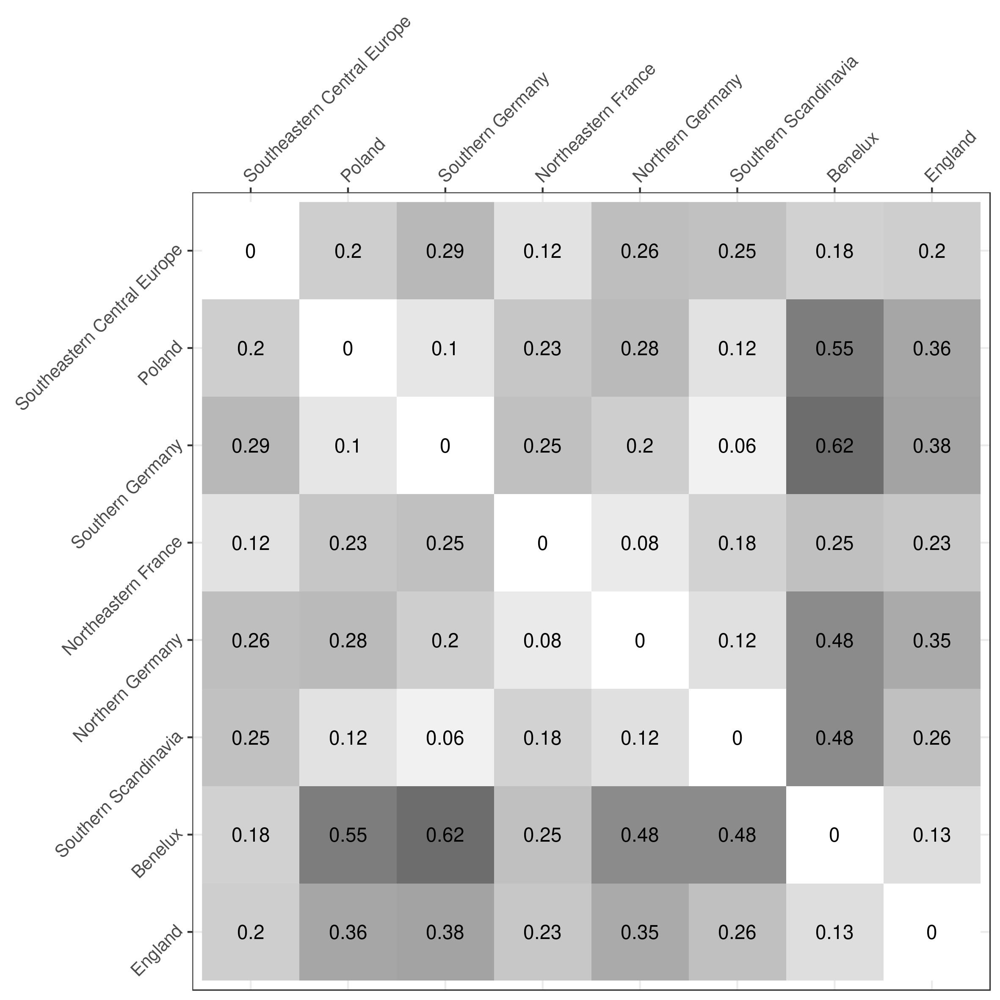{ height=85% }

\begin{textblock*}{55pt}(10pt,130pt)
  \setlength\fboxrule{2pt}%
  \noindent\fbox{%
    \begin{minipage}{\linewidth - 2\fboxsep - 2\fboxrule}%
      \raggedright\footnotesize\color{white}
      Central European Cluster?
    \end{minipage}}%
\end{textblock*}

## Mean Region Distance Matrix

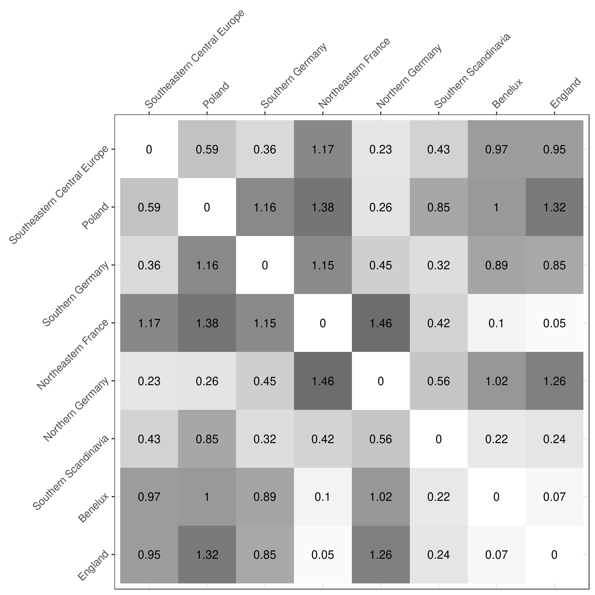{ height=85% }

\begin{textblock*}{55pt}(300pt,200pt)
  \setlength\fboxrule{2pt}%
  \noindent\fbox{%
    \begin{minipage}{\linewidth - 2\fboxsep - 2\fboxrule}%
      \raggedright\footnotesize\color{white}
      Northwestern European Cluster?
    \end{minipage}}%
\end{textblock*}

-->

## Parallel Developments?

\begin{columns}
  \begin{column}{0.48\textwidth}
    \begin{figure}
      \includegraphics{figures/regions_squared_euclidian_distance_burial_type.jpeg}
      \caption{\textbf{burial type} Development of SED to all the others for each region.}
    \end{figure}
  \end{column}
  \begin{column}{0.48\textwidth}
    \begin{figure}
      \includegraphics{figures/regions_squared_euclidian_distance_burial_construction.jpeg}
      \caption{\textbf{burial construction}\newline}
    \end{figure}
  \end{column}
\end{columns}

## Correlation of **Burial Type** and **Burial Construction** Distance

\begin{adjustwidth}{-3em}{-3em}
  \begin{figure}
    \includegraphics{figures/squared_euclidian_distance_burial_type_vs_burial_construction.jpeg}
    \caption{Correlation of \textbf{burial type} and \textbf{burial construction} mean SED in time slices of 200 years. \newline Each double point represents one region-region relationship.}
  \end{figure}
\end{adjustwidth}

\begin{textblock*}{60pt}(290pt,130pt)
  \setlength\fboxrule{2pt}%
  \noindent\fbox{%
    \begin{minipage}{\linewidth - 2\fboxsep - 2\fboxrule}%
      \raggedright\footnotesize\color{white}
      The distances of \textbf{burial type} and \textbf{construction} do \textbf{not correlate} -- except maybe in the late Early Bronze Age
    \end{minipage}}%
\end{textblock*}


# Cultural and Spatial Distance

## Spatial Distance Classes

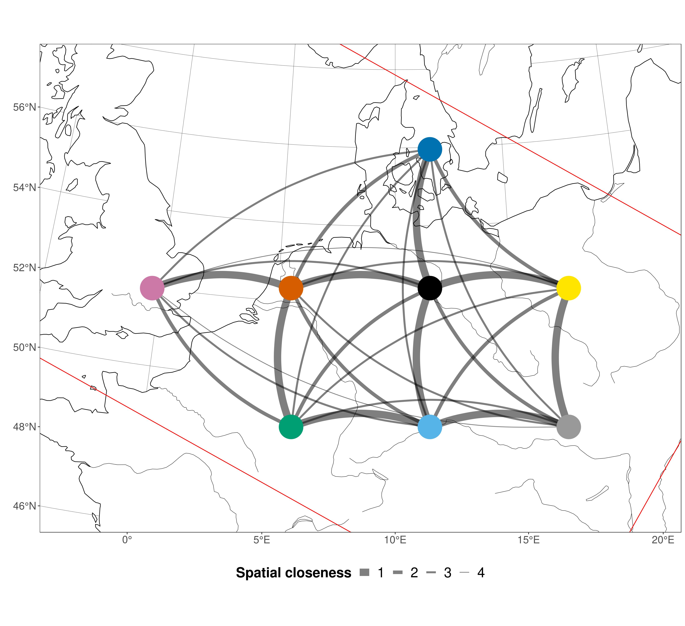{ height=85% }

\begin{textblock*}{100pt}(15pt,50pt)
  \setlength\fboxrule{2pt}%
  \noindent\fbox{%
    \begin{minipage}{\linewidth - 2\fboxsep - 2\fboxrule}%
      \raggedright\footnotesize\color{white}
      The definition of artificial regions as units of analysis makes distance measures difficult. \textbf{Ordinally scaled distance classes} are the only valid option here.
    \end{minipage}}%
\end{textblock*}

## Correlation of **Burial Type** and **Spatial** Distance

\begin{adjustwidth}{-3em}{-3em}
  \begin{figure}
    \includegraphics{figures/squared_euclidian_distance_vs_spatial_distance_burial_type.jpeg}
    \caption{\textbf{burial type}: Correlation of mean SED and spatial distance in timeslices of 200 years.}
  \end{figure}
\end{adjustwidth}

\begin{textblock*}{60pt}(290pt,130pt)
  \setlength\fboxrule{2pt}%
  \noindent\fbox{%
    \begin{minipage}{\linewidth - 2\fboxsep - 2\fboxrule}%
      \raggedright\footnotesize\color{white}
      Spatial distance is only relevant \textbf{before} the widespread transformation in the Middle Bronze Age starts
    \end{minipage}}%
\end{textblock*}

## Correlation of **burial construction** and **spatial** distance

\begin{adjustwidth}{-3em}{-3em}
  \begin{figure}
    \includegraphics{figures/squared_euclidian_distance_vs_spatial_distance_burial_construction.jpeg}
    \caption{\textbf{burial construction}: Correlation of mean SED and spatial distance in timeslices of 200 years.}
  \end{figure}
\end{adjustwidth}

\begin{textblock*}{60pt}(290pt,130pt)
  \setlength\fboxrule{2pt}%
  \noindent\fbox{%
    \begin{minipage}{\linewidth - 2\fboxsep - 2\fboxrule}%
      \raggedright\footnotesize\color{white}
      Spatial distance is overall \textbf{more relevant} and again in the late Early Bronze Age significant
    \end{minipage}}%
\end{textblock*}

# Simulation

## Preliminary Considerations

Funeral rituals are **behaviour/ideas/cultural traits** and spread in space and time. They exist in **social space** and their spread depends on social relationships.

\usebeamertemplate*{title separator}

Simulation concept: 

- Ideas are **entities** with simple behaviour: **greedy expansion**

- Ideas life in a configurable, diachronic **population network**

\usebeamertemplate*{title separator}

Funeral rituals are a special category of ideas: They have a relatively low interaction with the human-environment system and can be treated as **selectively neutral**. [Dunnell 1978]

The main mechanisms of diffusion of neutral variants are **innovation**, **drift** and **flow**. [Neiman 1995]

- **Drift:** Individual traits will dominate due to stochastic processes

- **Flow:** Information transfer causes synchronization across group boundaries

## Population Graph Creation

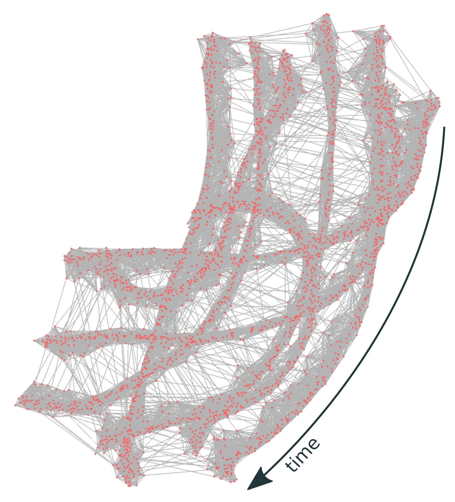{ height=85% }

\begin{textblock*}{130pt}(20pt,50pt)
  \setlength\fboxrule{2pt}%
  \noindent\fbox{%
    \begin{minipage}{\linewidth - 2\fboxsep - 2\fboxrule}%
      \footnotesize\raggedright\color{white}
      \textbf{R Package} to create undirected population networks with configurable \textbf{population size development}, \textbf{number of groups}, \textbf{degree of intra- and intergroup transmission}, etc.
    \end{minipage}}%
\end{textblock*}

\begin{textblock*}{100pt}(250pt,150pt)
  \setlength\fboxrule{2pt}%
  \noindent\fbox{%
    \begin{minipage}{\linewidth - 2\fboxsep - 2\fboxrule}%
      \footnotesize\raggedright\color{white}
      Every individual's position in social space and time is defined by their \textbf{vertical and horizontal} connections
    \end{minipage}}%
\end{textblock*}

\begin{textblock*}{100pt}(250pt,200pt)
  \setlength\fboxrule{2pt}%
  \noindent\fbox{%
    \begin{minipage}{\linewidth - 2\fboxsep - 2\fboxrule}%
      \footnotesize\raggedright\color{white}
      Groups have a \textbf{high degree of internal} and a \textbf{low degree of external} interaction
    \end{minipage}}%
\end{textblock*}

## Idea Expansion Simulation

```{cpp eval = FALSE, size = 'footnotesize'}
...
// make random decision to convert or ignore a node based on the edge weight
  std::vector<std::pair<int, bool>> success_per_neighbor(neighbors.size());
  for (auto& i : all_neighbors_information) {
    // make decision
    // if the node is already occupied, it's more difficult
    // if more than one contact, then there's a convincing bonus
    std::pair<int, bool> success;
    if (std::get<3>(i)) {
      success = std::make_pair(
        std::get<0>(i), 
        std::get<1>(i) * log2(std::get<2>(i) + 1) >= randunifrange(75, 100)
      );
    } else {
      success = std::make_pair(
        std::get<0>(i), 
        std::get<1>(i) * log2(std::get<2>(i) + 1) >= randunifrange(0, 100)
      );
    }
    success_per_neighbor.push_back(success);
  }
...
```

\begin{textblock*}{130pt}(210pt,210pt)
  \setlength\fboxrule{2pt}%
  \noindent\fbox{%
    \begin{minipage}{\linewidth - 2\fboxsep - 2\fboxrule}%
      \footnotesize\raggedright\color{white}
      \textbf{C++ CLI program} to simulate idea expansion within the population network
    \end{minipage}}%
\end{textblock*}

## Simulation Application: Correlation of Spatial and Cultural Distance

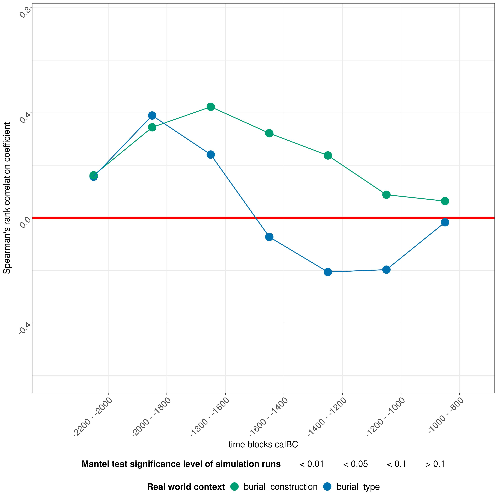{ height=88% }  

\begin{textblock*}{55pt}(10pt,40pt)
  \setlength\fboxrule{2pt}%
  \noindent\fbox{%
    \begin{minipage}{\linewidth - 2\fboxsep - 2\fboxrule}%
      \raggedright\footnotesize\color{white}
      Can correlation of spatial and cultural distance \textbf{be ruled out?}
    \end{minipage}}%
\end{textblock*}

## Simulation Application: Correlation of Spatial and Cultural Distance

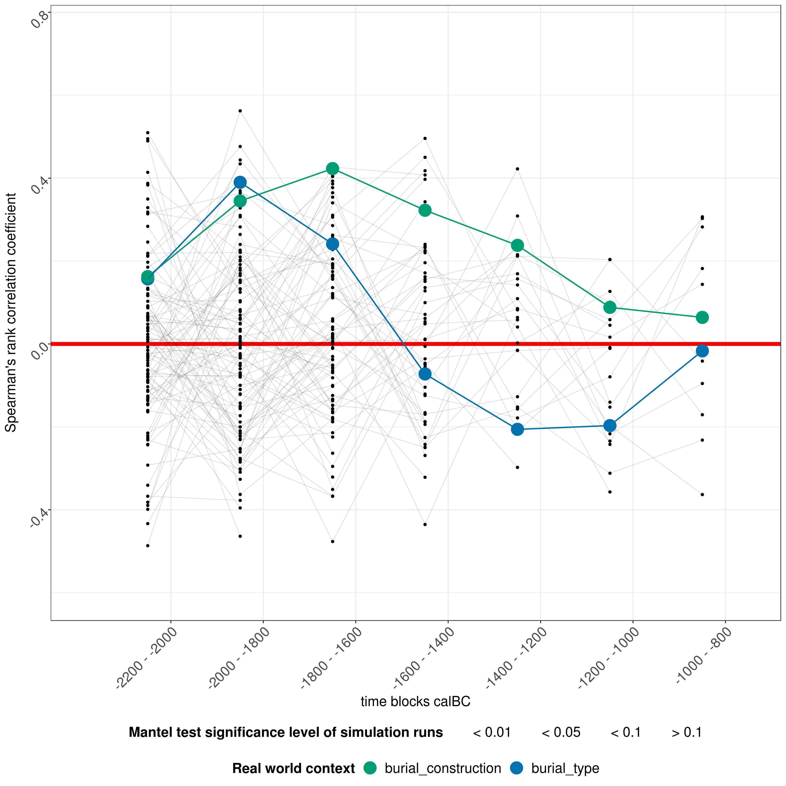{ height=88%  }

\begin{textblock*}{55pt}(10pt,40pt)
  \setlength\fboxrule{2pt}%
  \noindent\fbox{%
    \begin{minipage}{\linewidth - 2\fboxsep - 2\fboxrule}%
      \raggedright\footnotesize\color{white}
      Can correlation of spatial and cultural distance \textbf{be ruled out?}
    \end{minipage}}%
\end{textblock*}

## Simulation Application: Correlation of Spatial and Cultural Distance

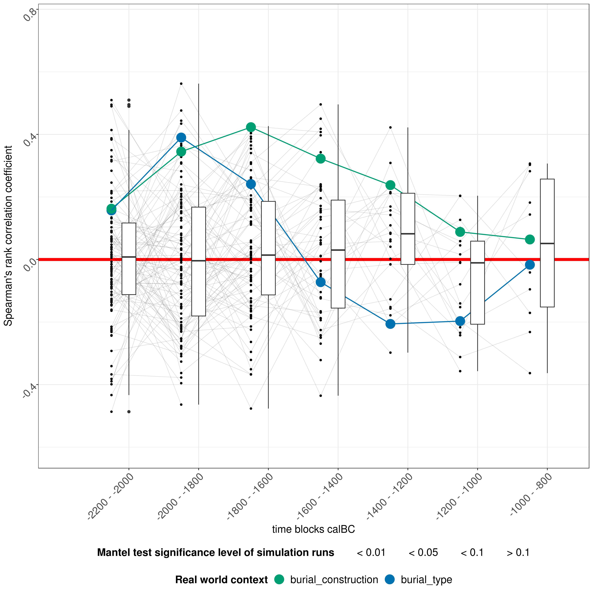{ height=88%  }

\begin{textblock*}{55pt}(10pt,40pt)
  \setlength\fboxrule{2pt}%
  \noindent\fbox{%
    \begin{minipage}{\linewidth - 2\fboxsep - 2\fboxrule}%
      \raggedright\footnotesize\color{white}
      Can correlation of spatial and cultural distance \textbf{be ruled out?}
    \end{minipage}}%
\end{textblock*}

\begin{textblock*}{55pt}(10pt,110pt)
  \textblockcolour{niceorange}
  \setlength\fboxrule{2pt}%
  \noindent\fbox{%
    \begin{minipage}{\linewidth - 2\fboxsep - 2\fboxrule}%
      \raggedright\footnotesize\color{white}
      \textbf{Equal intergroup distance}: Unlikely development in the Early Bronze Age   
    \end{minipage}}%
\end{textblock*}

## Simulation Application: Correlation of Spatial and Cultural Distance

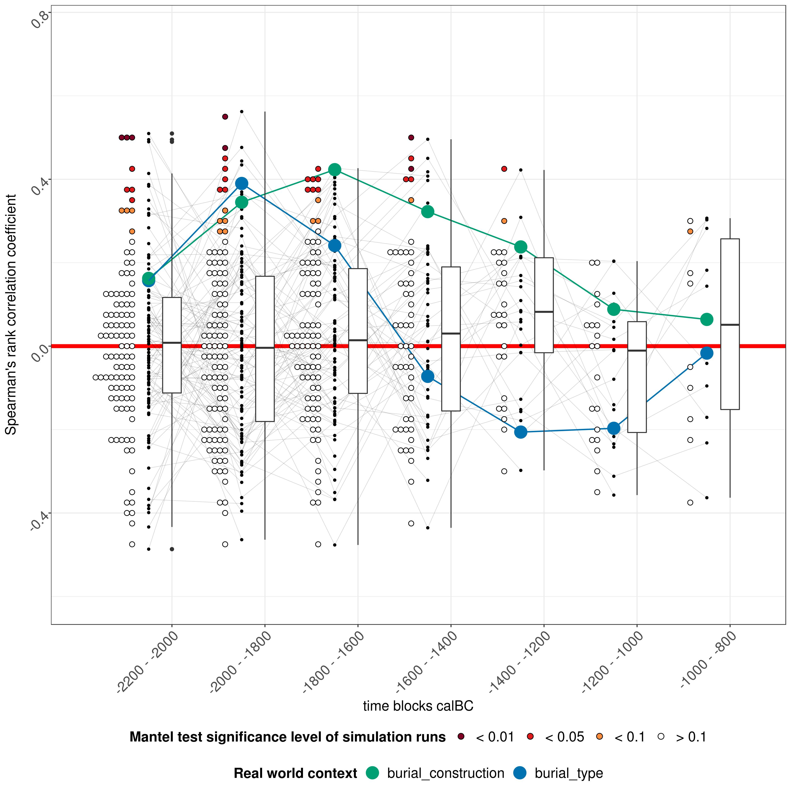{ height=88%  }

\begin{textblock*}{55pt}(10pt,40pt)
  \setlength\fboxrule{2pt}%
  \noindent\fbox{%
    \begin{minipage}{\linewidth - 2\fboxsep - 2\fboxrule}%
      \raggedright\footnotesize\color{white}
      Can correlation of spatial and cultural distance \textbf{be ruled out?}
    \end{minipage}}%
\end{textblock*}

\begin{textblock*}{55pt}(10pt,110pt)
  \textblockcolour{niceorange}
  \setlength\fboxrule{2pt}%
  \noindent\fbox{%
    \begin{minipage}{\linewidth - 2\fboxsep - 2\fboxrule}%
      \raggedright\footnotesize\color{white}
      \textbf{Equal intergroup distance}: Unlikely development in the Early Bronze Age
    \end{minipage}}%
\end{textblock*}

## Simulation Application: Correlation of Spatial and Cultural Distance

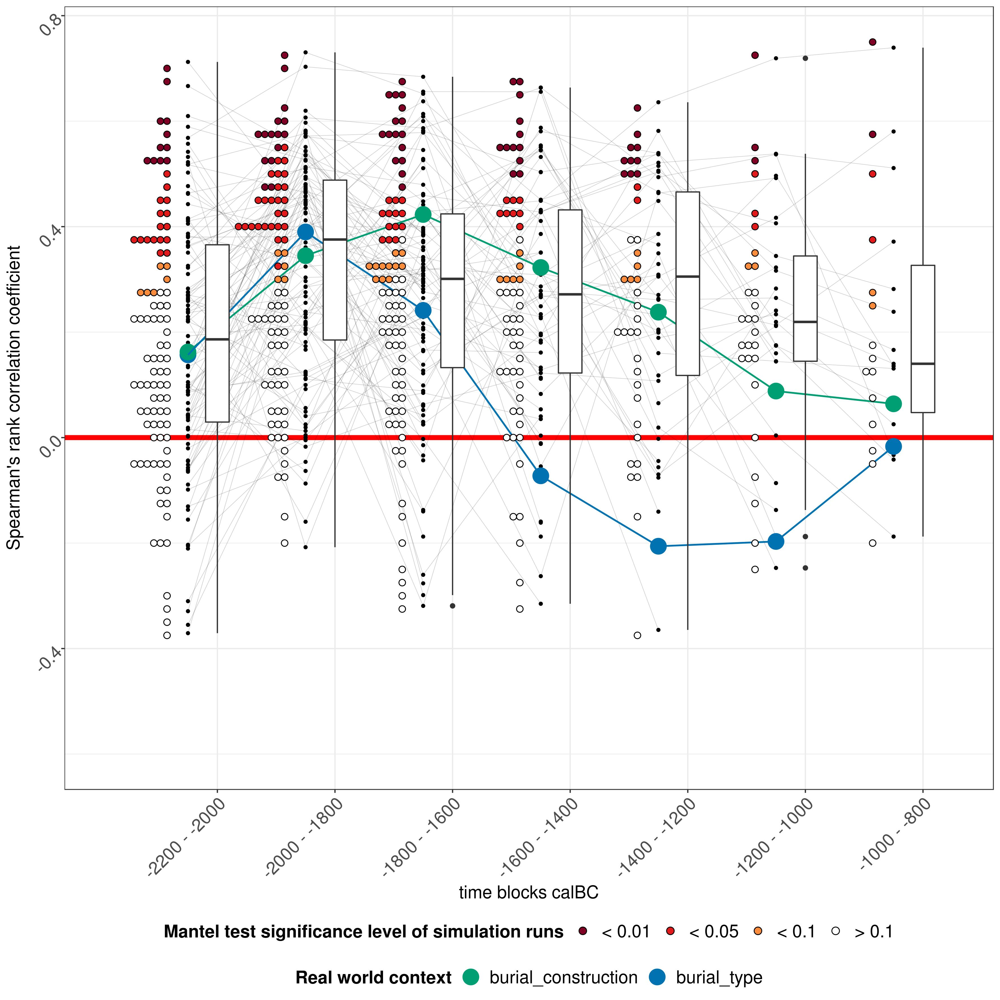{ height=88%  }

\begin{textblock*}{55pt}(10pt,40pt)
  \setlength\fboxrule{2pt}%
  \noindent\fbox{%
    \begin{minipage}{\linewidth - 2\fboxsep - 2\fboxrule}%
      \raggedright\footnotesize\color{white}
      Can correlation of spatial and cultural distance \textbf{be ruled out?}
    \end{minipage}}%
\end{textblock*}

\begin{textblock*}{55pt}(10pt,110pt)
  \textblockcolour{niceorange}
  \setlength\fboxrule{2pt}%
  \noindent\fbox{%
    \begin{minipage}{\linewidth - 2\fboxsep - 2\fboxrule}%
      \raggedright\footnotesize\color{white}
      \textbf{Equal intergroup distance}: Unlikely development in the Early Bronze Age   
    \end{minipage}}%
\end{textblock*}

\begin{textblock*}{60pt}(300pt,40pt)
  \textblockcolour{niceorange}
  \setlength\fboxrule{2pt}%
  \noindent\fbox{%
    \begin{minipage}{\linewidth - 2\fboxsep - 2\fboxrule}%
      \raggedright\footnotesize\color{white}
      \textbf{Spatial intergroup distance}: Unlikely development in the Late Bronze Age  
    \end{minipage}}%
\end{textblock*}

\begin{textblock*}{60pt}(300pt,120pt)
  \setlength\fboxrule{2pt}%
  \noindent\fbox{%
    \begin{minipage}{\linewidth - 2\fboxsep - 2\fboxrule}%
      \raggedright\footnotesize\color{white}
      \textbf{burial type} behaves \textbf{highly atypical} if we assume spatial correlation
    \end{minipage}}%
\end{textblock*}

# Conclusion

## Observations and Hypotheses

- The diffusion of the **cremation funeral tradition** and **traditions of flat vs. mound graves** are **independent**.

- Both processes are **mostly independent** of **spatial distance**: Not a simple diffusion process!

- **Other interaction networks** could yield better predictions: Elite Networks, Religious superstructures, ...

\usebeamertemplate*{title separator}

- **Sociocultural complexity** in the Bronze Age is generally **increasing**. Still the **homogeneity & heterogeneity** of certain cultural traits **vary greatly**.

##

\titlepage
  
